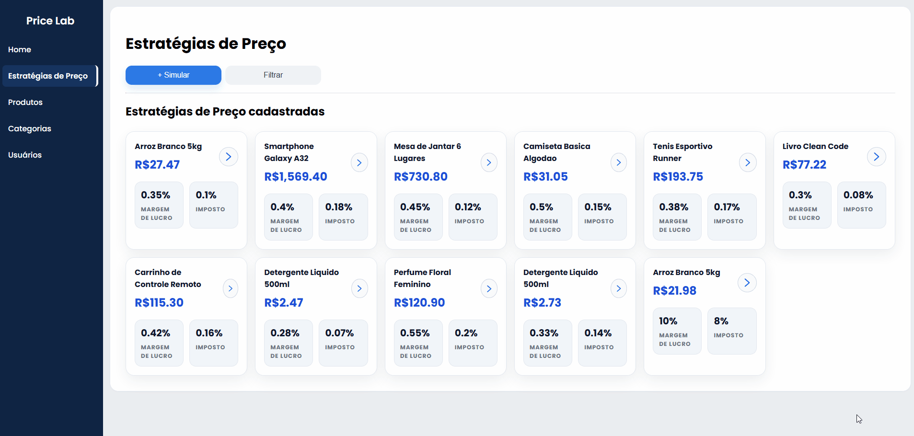
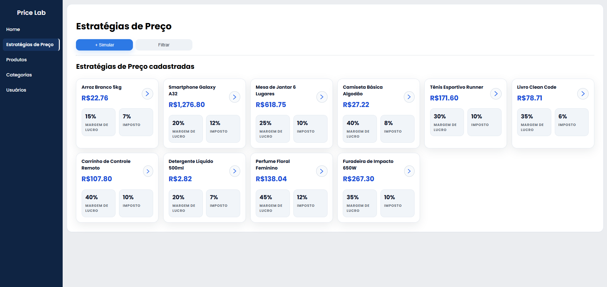
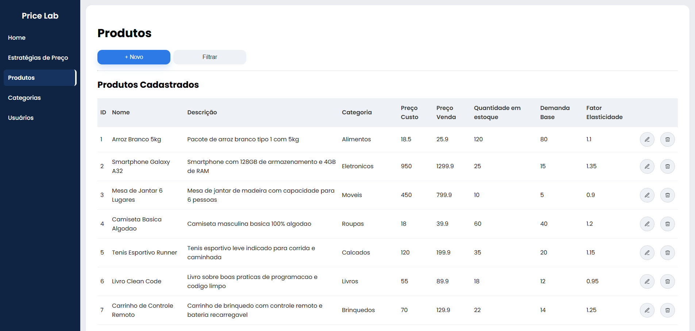
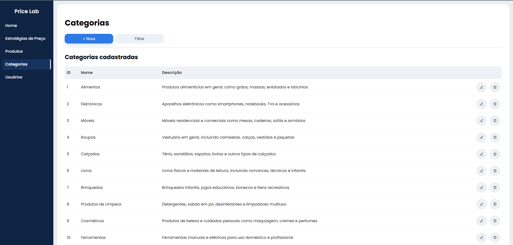

# 📊 PriceLab

> PriceLab é um sistema fullstack de gestão de produtos que permite cadastrar produtos e categorias, simular estratégias de precificação com base em margem de lucro, impostos e elasticidade de demanda, e visualizar a composição financeira de cada produto.

Desenvolvido por **Felipe Boos**

---

### Estratégias de Preço — simulação


### Estratégias de Preço — listagem


### Produtos


### Categorias


---

## 🛠️ Stack

### Backend
| Tecnologia | Uso |
|---|---|
| Java 17 | Linguagem principal |
| Spring Boot | Framework web |
| Spring Web | API REST |
| Spring Data JPA | Persistência de dados |
| PostgreSQL | Banco de dados relacional |
| Flyway | Versionamento de migrations do banco |
| Maven | Gerenciador de dependências |
| JUnit 5 | Testes unitários automatizados |

### Frontend
| Tecnologia | Uso |
|---|---|
| Angular | Framework SPA |
| TypeScript | Linguagem principal |
| HTML / CSS | Interface |

### DevOps
| Tecnologia | Uso |
|---|---|
| GitHub Actions | CI/CD com workflow de testes automatizados |

---

## Funcionalidades

- **CRUD completo de Produtos** — criação, listagem, edição e exclusão
- **CRUD completo de Categorias** — criação, listagem, edição e exclusão
- **Simulação de Estratégias de Preço** — cálculo de preço sugerido com base em margem de lucro, impostos e elasticidade de demanda
- **Análise financeira visual** — composição de custo, margem e imposto com gráfico interativo
- **API REST** documentada e integrada ao frontend Angular (SPA)

---

## Como executar localmente

### Pré-requisitos

- Java 17+
- Node.js 18+ e npm
- PostgreSQL rodando localmente
- Angular CLI: `npm install -g @angular/cli`

### 1. Configurar o banco de dados

Crie um banco PostgreSQL e configure as credenciais no `application.properties` (ou `application.yml`) do backend:

```properties
spring.datasource.url=jdbc:postgresql://localhost:5432/pricelab
spring.datasource.username=seu_usuario
spring.datasource.password=sua_senha
```

As migrations do Flyway serão aplicadas automaticamente ao iniciar o backend.

### 2. Iniciar o Backend

```bash
cd backend
./mvnw spring-boot:run
```

API disponível em: `http://localhost:8080`

### 3. Iniciar o Frontend

```bash
cd frontend
npm install
ng serve
```

Aplicação disponível em: `http://localhost:4200`

---

## Testes

Os testes unitários rodam com JUnit 5 e são executados automaticamente no pipeline de CI via GitHub Actions a cada push.

Como rodar localmente:

```bash
cd backend
./mvn test
```

---

## ⚙️ CI/CD — GitHub Actions

O projeto conta com um workflow de integração contínua que executa os testes automaticamente em cada push ou pull request para a branch `main`.

Arquivo de configuração: `.github/workflows/tests.yml`

---

## 📁 Estrutura do Projeto

```
pricelab/
├── backend/           # API REST — Spring Boot
│   ├── src/
│   │   ├── main/
│   │   │   ├── java/       # Código-fonte Java
│   │   │   └── resources/
│   │   │       ├── db/migration/   # Migrations Flyway
│   │   │       └── application.properties
│   │   └── test/           # Testes JUnit
│   └── pom.xml
├── frontend/          # SPA — Angular
│   ├── src/
│   │   └── app/
│   └── package.json
└── README.md
```

---

## 📌 Status do Projeto

🟡 **Em desenvolvimento**

| Funcionalidade | Status |
|---|---|
| CRUD de Categorias | ✅ Concluído |
| CRUD de Produtos | ✅ Concluído |
| Simulação de Estratégias de Preço | ✅ Concluído |
| Integração Angular + REST API | ✅ Concluído |
| GitHub Actions (CI com testes) | ✅ Concluído |
| Testes unitários (JUnit) | ✅ Concluído |
| Autenticação JWT | 🔲 Planejado |
| Filtros e paginação | 🔲 Planejado |
| Validações visuais no frontend | 🔲 Planejado |

---

## 👤 Autor

**Felipe Boos**

[](https://www.linkedin.com/in/felipe-boos-922380241/)
[](https://github.com/FelipeBoos)
