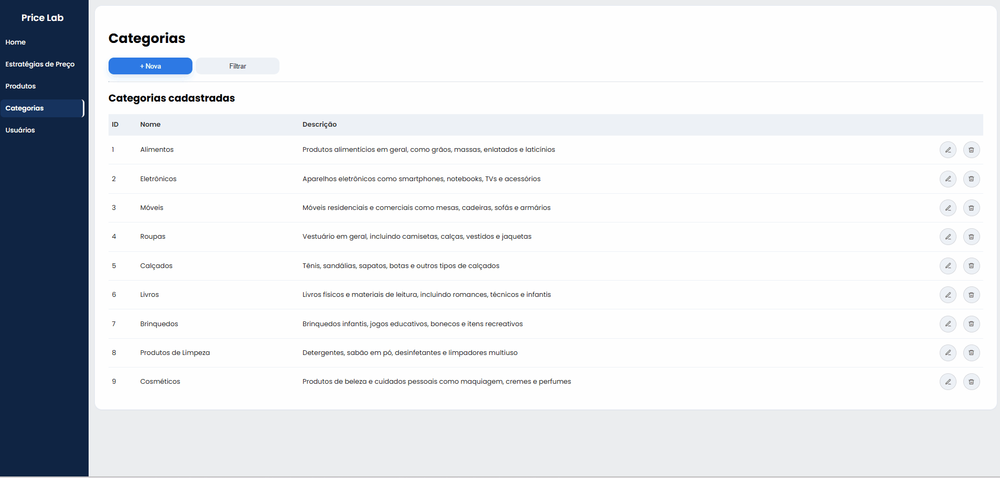
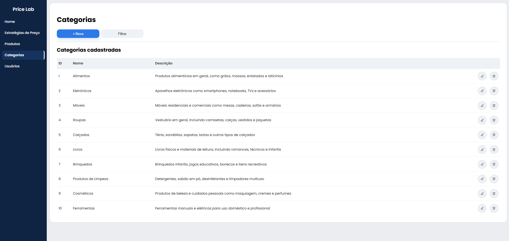
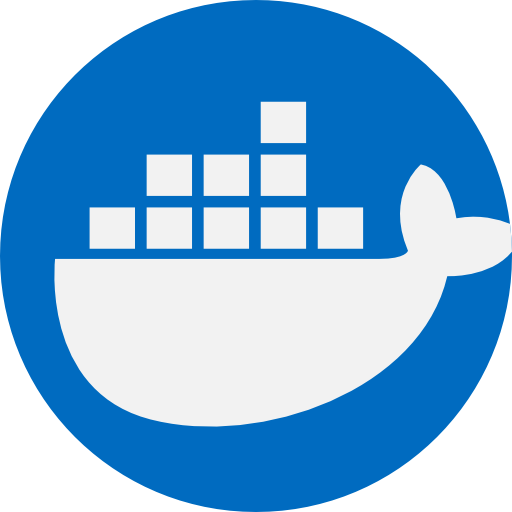

# 📊 PriceLab

> PriceLab é um sistema fullstack de gestão de produtos com suporte a múltiplas moedas e cálculo automático de custos de importação, permitindo simular estratégias de precificação com base em margem, impostos e elasticidade de demanda.

Desenvolvido por **Felipe Boos**

---

## Estratégias de Preço 

### Simulação de estratégias de preço


### Listagem de estratégias de preço


## Produtos

###  Cadastro de Produtos


###  Fluxo de Cadastro (com cálculo automático)


### Listagem de produtos


## Categorias

###  Cadastro de categorias

 
### Listagem de categorias


---

## Stack

### Backend
| Tecnologia | Uso |
|---|---|
| Java 21 | Linguagem principal |
| Spring Boot | Framework web |
| Spring Web | API REST |
| Spring Data JPA | Persistência de dados |
| PostgreSQL | Banco de dados relacional |
| Flyway | Versionamento de migrations do banco |
| Maven | Gerenciador de dependências |
| JUnit 5 | Testes unitários automatizados |

### Frontend
| Tecnologia | Uso |
|---|---|
| Angular | Framework SPA |
| TypeScript | Linguagem principal |
| HTML / CSS | Interface |

### DevOps & Observabilidade
| Tecnologia | Uso |
|---|---|
| Docker | Containerização da aplicação |
| Kubernetes | Orquestração de containers |
| kubectl | CLI de gerenciamento do Kubernetes |
| GitHub Actions | CI/CD com workflow de testes automatizados |
| Spring Boot Actuator | Health checks e métricas da aplicação |
| Prometheus | Coleta de métricas |
| Grafana | Dashboards e visualização de métricas |

---

## Decisões Técnicas

Algumas escolhas do projeto foram feitas com foco em escalabilidade, organização e boas práticas de desenvolvimento.

###   Suporte a múltiplas moedas

Produtos podem ser cadastrados em BRL, USD ou EUR, com conversão automática para reais.

**Foi utilizada a API [Frankfurter](https://www.frankfurter.dev/) para buscar valores atualizados para cotação das moedas estrangeiras.**

**Motivação:**
- Abstrair a moeda como um atributo do produto, desacoplando o valor de entrada do custo final em BRL
- Centralizar a lógica de conversão no backend, evitando cálculos distribuídos no frontend
- Consumir cotações em tempo real via API externa para não depender de valores estáticos

###   Flyway — Versionamento do Banco de Dados

Utilizei o Flyway para versionamento das migrations do banco de dados.

**Motivação:**
- Garantir controle de versão do schema
- Evitar inconsistência entre ambientes
- Facilitar evolução do banco de forma segura

###   Docker - Containerização da aplicação

A aplicação foi totalmente containerizada, incluindo backend, frontend e banco de dados.

**Motivação:**
- Padronizar o ambiente de execução
- Facilitar o setup do projeto
- Melhorar a portabilidade

###  Kubernetes — Orquestração de Containers

O projeto utiliza Kubernetes para orquestração dos containers da aplicação, permitindo gerenciamento automatizado dos serviços, escalabilidade horizontal e maior aproximação de um ambiente real de produção.

Foram adicionados:

- Deployments para backend, frontend e PostgreSQL
- Services para comunicação interna entre os serviços
- ConfigMap e Secret para gerenciamento de configurações
- PersistentVolumeClaim (PVC) para persistência do banco
- Múltiplas réplicas do backend com recuperação automática de pods

**Motivação:**
- Demonstrar conhecimentos de orquestração de containers
- Melhorar disponibilidade e tolerância a falhas
- Permitir escalabilidade horizontal da aplicação
- Aproximar o projeto de arquiteturas utilizadas em produção

###  Versionamento Semântico Automatizado (GitHub Actions)

O versionamento do projeto é realizado automaticamente utilizando GitHub Actions com base em versionamento semântico.

**Motivação:**
- Padronizar a evolução das versões do projeto
- Evitar versionamento manual e erros humanos
- Gerar histórico claro de mudanças (features, correções, refactors)

###  Observabilidade — Actuator, Prometheus e Grafana

O projeto possui monitoramento e observabilidade utilizando Spring Boot Actuator, Prometheus e Grafana.

Foram adicionados:
- Health checks da aplicação e banco de dados
- Métricas HTTP da API
- Métricas JVM
- Métricas de conexões do banco
- Dashboards customizados no Grafana

**Motivação:**
- Facilitar troubleshooting e debugging
- Melhorar visibilidade da aplicação
- Permitir monitoramento de performance
- Preparar o projeto para ambientes mais próximos de produção

---

## Funcionalidades

- **CRUD completo de Produtos** — criação, listagem, edição e exclusão
- **CRUD completo de Categorias** — criação, listagem, edição e exclusão
- **Simulação de Estratégias de Preço** — cálculo de preço sugerido com base em margem de lucro, impostos e elasticidade de demanda
- **Análise financeira visual** — composição de custo, margem e imposto com gráfico interativo
- **API REST** documentada e integrada ao frontend Angular (SPA)
- **Observabilidade e Monitoramento** — métricas da aplicação, health checks e dashboards Grafana integrados ao Prometheus
- **Orquestração com Kubernetes** — deploy escalável da aplicação com recuperação automática de pods

---

## Testes

Os testes unitários rodam com JUnit 5 e são executados automaticamente no pipeline de CI via GitHub Actions a cada push.

Como rodar localmente:

```bash
cd backend
./mvn test
```

---

##   CI/CD — GitHub Actions

O projeto conta com um workflow de integração contínua que executa os testes automaticamente em cada push ou pull request para a branch `main`.

Workflows disponíveis:

- backend-ci.yml
- frontend-ci.yml
- docker-ci.yml
- release.yml

---

## Estrutura do Projeto

```
pricelab/
├── backend/  
│   ├── src/
│   │   ├── main/
│   │   │   ├── java/       
│   │   │   └── resources/
│   │   │       ├── db/migration/  
│   │   │       └── application.properties
│   │   └── test/        
│   └── pom.xml
├── frontend/          
│   ├── src/
│   │   └── app/
│   └── package.json
├── k8s/
│   ├── backend/
│   ├── config/
│   ├── database/
│   └── frontend/
└── README.md
```

---

## Status do Projeto

🟡 **Em desenvolvimento**

| Funcionalidade | Status |
|---|---|
| CRUD de Categorias | ✅ Concluído |
| CRUD de Produtos | ✅ Concluído |
| Simulação de Estratégias de Preço | ✅ Concluído |
| Importação e Moeda | ✅ Concluído |
| Integração Angular + REST API | ✅ Concluído |
| GitHub Actions (CI com testes) | ✅ Concluído |
| Testes unitários (JUnit) | ✅ Concluído |
| Observabilidade com Prometheus + Grafana | ✅ Concluído |
| Health Checks Docker e Backend | ✅ Concluído |
| Orquestração com Kubernetes | ✅ Concluído |
| Autenticação JWT | 🔲 Planejado |
| Filtros e paginação | 🔲 Planejado |
| Validações visuais no frontend | 🔲 Planejado |

---

# Como executar o projeto

Existem quatro formas de executar o projeto: Acessando ao link da demo online, executando pelo Docker, executando localmente na sua máquina ou executando com Kubernetes.

##  Acessando a demo online

Você pode acessar a aplicação pelo link: [Price Lab](https://pricelab-app.onrender.com/)

Frontend: https://pricelab-app.onrender.com  
Backend API: https://pricelab-api.onrender.com

### Exemplos de endpoints do backend: 
- https://pricelab-api.onrender.com/categorias
- https://pricelab-api.onrender.com/produtos
- https://pricelab-api.onrender.com/estrategias-preco

> Nota: o ambiente de demonstração utiliza plano gratuito do Render, então a primeira requisição após inatividade pode demorar alguns minutos.

##  Executando com Docker

### Pré-requisitos

- Docker Desktop instalado e em execução

### 1. Clonar o repositório

Clone o repositório na sua máquina executando os comandos abaixo:

```bash
git clone https://github.com/FelipeBoos/PriceLab.git
```

### 2. Criar o arquivo .env

Copie o arquivo **.env.example** para **.env** executando o comando abaixo na raiz do projeto:

```bash
cd PriceLab
cp .env.example .env
```

> ⚠️ O arquivo `.env` é obrigatório. Sem ele, o banco de dados não será iniciado corretamente.
Obs: Se você alterar as credenciais do banco depois da primeira inicialização, pode ser necessário recriar o volume com o comando **docker compose down -v**.

### 3. Subir toda a aplicação

Execute os comandos abaixo no diretório em que o repositório foi clonado para executar a aplicação:

```bash
docker compose up --build
```

### 4. Acessar a aplicação

Depois de subir a aplicação, os serviços ficam disponíveis em:

- Frontend: `http://localhost:4200`
- Backend API: `http://localhost:8080`
- PostgreSQL: `localhost:5433`
- Prometheus: `http://localhost:9090`
- Grafana: `http://localhost:3000`

### 5. Encerrar os containers

Execute o comando abaixo na raiz do projeto:

```bash
docker compose down
```

### 6. Resetar o banco de dados (opcional)

Se quiser iniciar com o banco limpo:

```bash
docker compose down -v
```

### Observações

- As migrations do Flyway são executadas automaticamente ao iniciar o backend
- Os dados do banco são persistidos em um volume Docker
- O frontend é servido em container com Nginx
- O backend consulta a API externa de câmbio para obter as cotações utilizadas nos cálculos de importação. Se quiser conferir a documentação do serviço, veja a [Frankfurter API](https://www.frankfurter.dev/).

---

##  Executando localmente

### Pré-requisitos

- Java 17+
- Node.js 18+ e npm
- PostgreSQL rodando localmente
- Angular CLI: `npm install -g @angular/cli`

### 1. Criar o banco de dados

Crie um banco PostgreSQL chamado pricelab.

### 2. Configurar variáveis de ambiente do backend

O backend lê as credenciais do banco por variáveis de ambiente. Exemplo no PowerShell:

```PowerShell
$env:SPRING_DATASOURCE_URL="jdbc:postgresql://localhost:5432/pricelab"
$env:SPRING_DATASOURCE_USERNAME="postgres"
$env:SPRING_DATASOURCE_PASSWORD="sua_senha"
```

As migrations do Flyway serão aplicadas automaticamente ao iniciar o backend.

### 3. Iniciar o Backend

Execute o comando abaixo no diretório em que o projeto foi clonado

```bash
cd backend
./mvnw spring-boot:run
```

API disponível em: `http://localhost:8080`

### 4. Iniciar o Frontend

```bash
cd frontend
npm install
ng serve
```

Aplicação disponível em: `http://localhost:4200`

---
##  Executando com Kubernetes

### Pré-requisitos

- Docker Desktop instalado
- Kubernetes habilitado no Docker Desktop
- kubectl instalado e configurado

### 1. Clonar o repositório

Clone o repositório na sua máquina executando os comandos abaixo:

```bash
git clone https://github.com/FelipeBoos/PriceLab.git
```

### 2. Habilitar o Kubernetes no Docker Desktop

Abra o Docker Desktop e acesse:

```text
Settings > Kubernetes > Enable Kubernetes
```

Depois de habilitar, valide se o cluster está funcionando:

```bash
kubectl config current-context
kubectl get nodes
```

### 3. Criar as imagens Docker da aplicação

Execute os comandos abaixo na raiz do projeto:

```bash
cd PriceLab

docker build -t pricelab-backend:latest ./backend
docker build -t pricelab-frontend:latest ./frontend
```

### 4. Aplicar os manifests Kubernetes

Execute os comandos abaixo na raiz do projeto:

```bash
kubectl apply -f k8s/namespace.yaml

kubectl apply -f k8s/config/

kubectl apply -f k8s/database/

kubectl apply -f k8s/backend/

kubectl apply -f k8s/frontend/
```

### 5. Validar os recursos Kubernetes

Execute os comandos abaixo para verificar se todos os recursos foram criados corretamente:

```bash
kubectl get pods -n pricelab

kubectl get svc -n pricelab

kubectl get pvc -n pricelab
```

Todos os pods devem aparecer com status:

```text
Running
```

### 6. Acessar a aplicação

Em um terminal, execute:

```bash
kubectl port-forward service/backend-service 8080:8080 -n pricelab
```

Em outro terminal, execute:

```bash
kubectl port-forward service/frontend-service 4200:80 -n pricelab
```

Depois de executar os comandos acima, a aplicação ficará disponível em:

- Frontend: `http://localhost:4200`
- Backend API: `http://localhost:8080`

### 7. Encerrar os recursos Kubernetes

Execute os comandos abaixo:

```bash
kubectl delete -f k8s/frontend/

kubectl delete -f k8s/backend/

kubectl delete -f k8s/database/

kubectl delete -f k8s/config/

kubectl delete -f k8s/namespace.yaml
```

### Observações

- O backend utiliza Spring Boot e é executado em múltiplos pods
- O frontend Angular é servido utilizando Nginx
- O PostgreSQL utiliza PersistentVolumeClaim (PVC) para persistência dos dados
- As migrations do Flyway são executadas automaticamente ao iniciar o backend
- O Kubernetes realiza recuperação automática de pods em caso de falha
- A comunicação entre os serviços ocorre através dos Services internos do Kubernetes
- ConfigMap é utilizado para configurações não sensíveis
- Secret é utilizado para armazenar credenciais do banco de dados

---


## 👤 Autor

**Felipe Boos**

[](https://www.linkedin.com/in/felipe-boos-922380241/)
[](https://github.com/FelipeBoos)